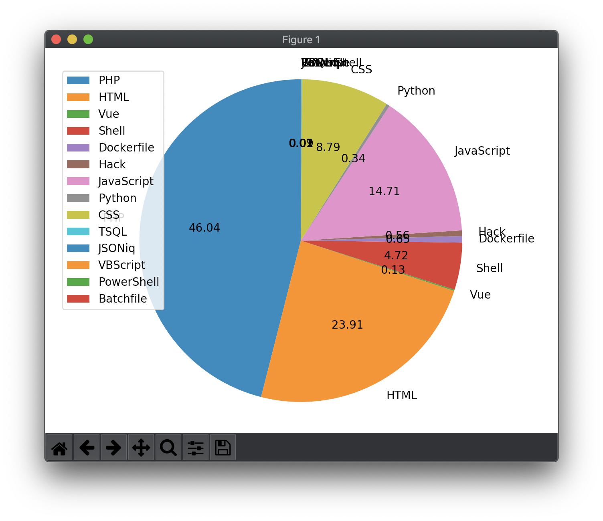

<div align="center">

# Linguist Breakdown

View the language breakdown of your entire GitHub account.

[](https://github.com/Justintime50/linguist-breakdown/actions)
[](https://coveralls.io/github/Justintime50/linguist-breakdown?branch=main)
[](https://pypi.org/project/linguist-breakdown)
[](https://opensource.org/licenses/mit-license.php)



</div>

This project is dated and lacks features found in more modern libraries such as [github-readme-stats](https://github.com/anuraghazra/github-readme-stats) or [metrics](https://github.com/lowlighter/metrics) and as such has been archived.

GitHub displays beautiful language breakdowns on each repo on their website; however, they do not show your entire language breakdown across all your projects.

Linguist Breakdown can return the language breakdown of your personal repos or all repos you have access to individually via the command line, then Linguist Breakdown will build a customized pie chart breakdown of your overall language usage across all repos (limited to the top 8 for clarity; all languages are returned via CLI). Configure some settings and quickly find out what languages you use the most!

**Sample Output:**

```bash
Overall language breakdown:

{
    "JavaScript": 33.77,
    "PHP": 27.36,
    "HTML": 12.33,
    "Python": 8.5,
    "Shell": 5.49,
    "CSS": 5.44,
    "Blade": 3.91,
    "Go": 0.77,
    "Dockerfile": 0.39,
    "C#": 0.39,
    "Hack": 0.38,
    "Makefile": 0.34,
    "Java": 0.34,
    "Ruby": 0.2,
    "Emacs Lisp": 0.09,
    "Vue": 0.08,
    "PowerShell": 0.06,
    "Batchfile": 0.05,
    "TSQL": 0.05,
    "Zimpl": 0.03,
    "JSONiq": 0.01,
    "VBScript": 0.01
}
```

## Install

```bash
# Install tool
pip3 install linguist-breakdown

# Install locally
make install

# Get Makefile help
make help
```

## Usage

**NOTE:** Percentages may vary from the terminal output and chart depending on how many chart pieces you elect to use (eg: using only 4 chart pieces when you have 10 languages that output on the console).

```
Usage:
    GITHUB_TOKEN=123... linguist-breakdown --type private --pieces 4 --forks --chart

Options:
    -h, --help            show this help message and exit
    -t TYPE, --type TYPE  The repo type to look at (OPTIONS: all, owner, member, private, public).
    -p PIECES, --pieces PIECES
                            Number of chart pieces to generate (will use greatest percentages)
    -f, --forks           Include forked repos in the language breakdown.
    -c, --chart           Generate a chart of the language breakdown.
```

## Development

```bash
# Lint the project
make lint

# Run tests
make test

# Run test coverage
make coverage

# Run the tool locally
venv/bin/python linguist_breakdown/breakdown.py --help
```
