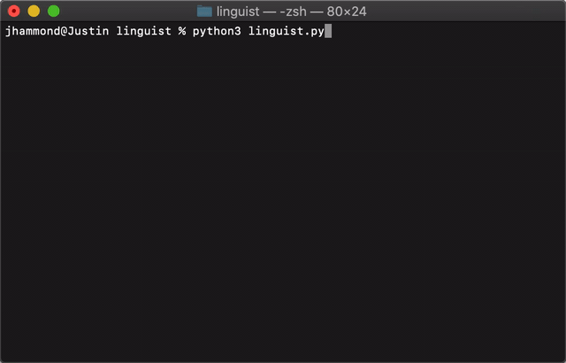

<div align="center">

# Linguist

Return the languages of your entire Github instance.

[](https://travis-ci.org/Justintime50/linguist)
[](https://opensource.org/licenses/mit-license.php)



</div>

Linguist can return the language breakdown of your personal repos or all repos you have access to. Configure some settings and quickly find out what languages you use the most.

## Usage

Change the username in the script and run the following. Enter your password/token when prompted:

```bash
python3 linguist.py
```

## Roadmap

These features are intended to be addressed in the future:

- Linguist currently only allows up to 100 repos to be pulled
- Linguist does not provide an overall language counter yet
